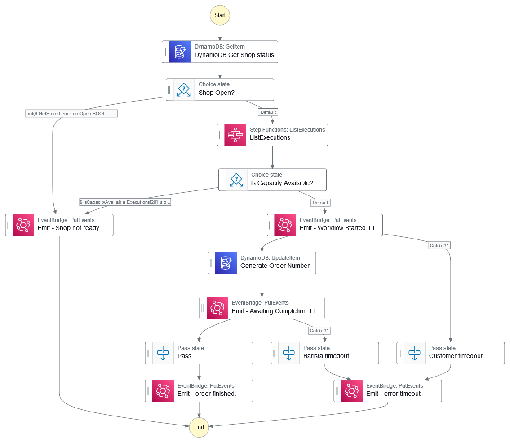
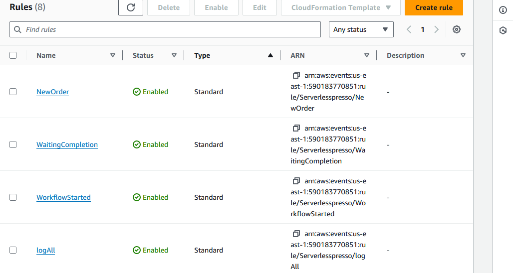
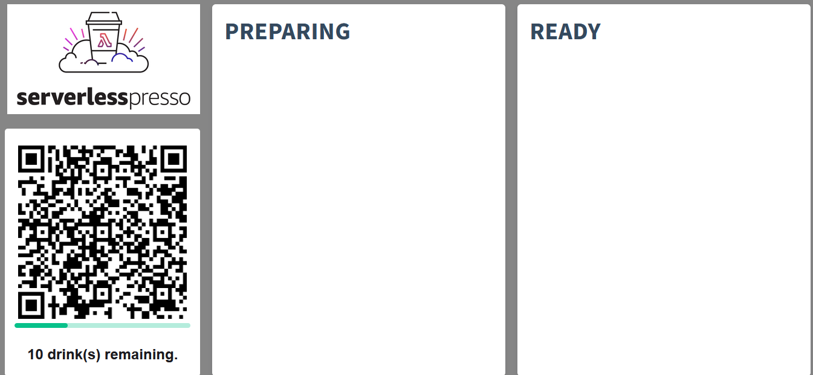
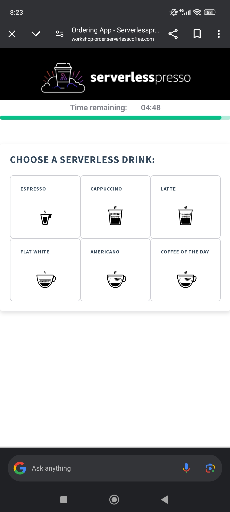
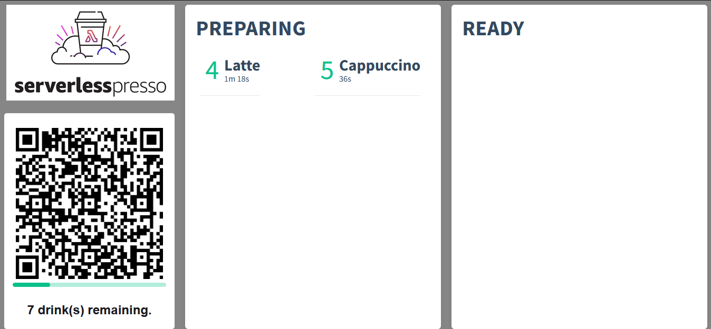
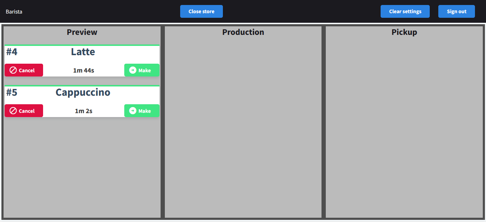
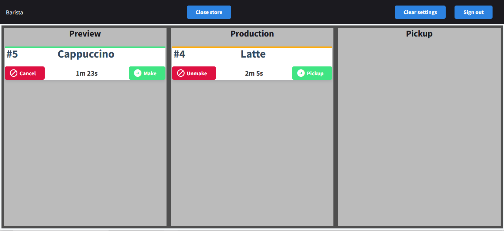
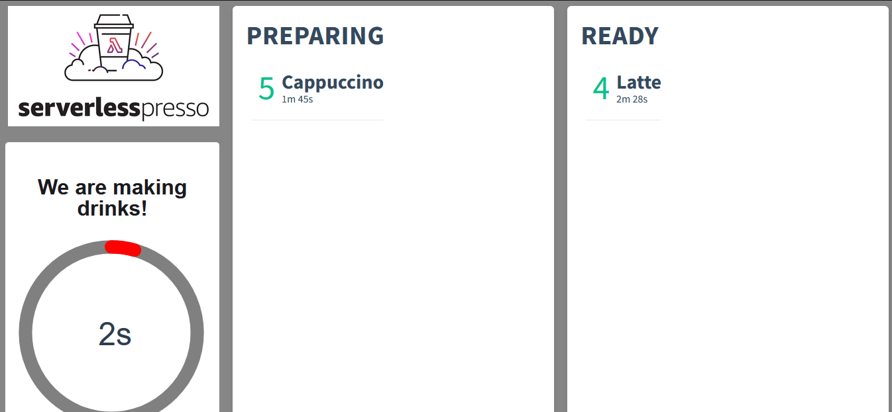

# Serverlesspresso

### 1. Funcionamento
1. Um monitor mostra um QR code que muda a cada 5 minutos. Os clientes scaneam o QR code utilizando o aplicativo mobile para fazer um pedido. O QR code funciona para 10 drinks e depois desaparece até completar os 5 minutos. Isso serve para não sobrecarregar os baristas.  
2. O backend valida o pedido feito pelo cliente, cria um número para o pedido e o torna disponível para os baristas.   
3. Os baristas recebem o pedido no aplicativos próprio deles. Eles podem mudar o status do pedido para indicar quando ele está completo, se será preciso cancelar, etc.
4. O cliente vê todas as atualizações dos baristas no aplicativo e o monitor também mostra o status dos drinks. 

### 2. Criando um Workflow
Para criar um workflow: https://aws.amazon.com/step-functions/.

Pode ser feito usando Amazon State Language (ASL) — uma linguagem baseada em JSON usada para definir state machines ou o Workflow Studio do AWS Management Console.

O workflow resultante do passo-a-passo do workshop: 

### 3. Roteando eventos
Eventos são sinais de que o estado do sistema foi alterado. Na AWS, eventos são representados por mensagens JSON contendo um conjunto de fatos sobre o que mudou e o que potencialmente pode mudar no estado do sistema.

Eventos são:
- **Factuais:** são baseados em algo que aconteceu
- **Imutáveis:** não podem ser desfeitos
- **Observáveis:** microsserviços podem se inscrever em eventos que são importantes para eles
- **Temporais:** o tempo de um evento importa

O workflow criado no módulo anterior emite eventos dependendo do estado e espera pela resposta antes de continuar. Os eventos são emitidos para um _serverless event bus_ onde são roteados para os serviços relevantes. O roteamento é feito pelo [Amazon EventBridge](https://aws.amazon.com/eventbridge/). Neste módulo foram criadas as regras no _EventBridge_ para capturar e rotear esses eventos para o serviços relevantes.

Essas são as _rules_ criadas para o funcionamento do _Servelesspresso_

### 4. Configurando o frontend
O frontend permite os clientes a baristas interagirem com o backend da aplicação. A aplicação possui três frontends:
1. **Display App:** exibe o QR Code e a situação dos pedidos
2. **Barista App:** permite ao barista completar e cancelar pedidos conforme eles chegam 
3. **Costumer App:** permite aos clientes enviarem pedidos

O frontend do _Serverlesspresso_ utiliza o padrão de publicação de mensagens utilizando o WebSockets.

Para enviar um pedido o cliente scaneia o QR Code que se encontra no canto inferior esquerdo do _Display App_

Após scanear, ele encontrará a seguinte tela onde pode escolher seu drink

Após os pedidos dos clientes serem enviados, o _Display App_ e o _Barista App_ se encontram assim

Após o barista começar a produzir o drink e após ele finalizar o drink, as telas se encontram assim

